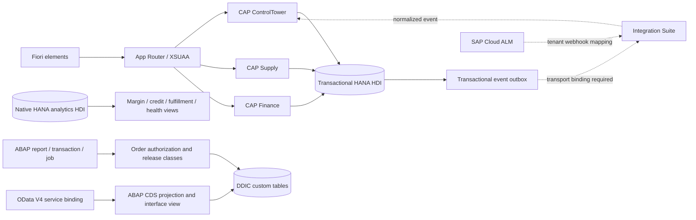

# Enterprise control tower

The CAP core has 36 persisted domain entities across master data, sales, supply, finance, and operations. Three services separate order operations, purchasing visibility, and financial posting. Company attributes govern order, stock, incident and journal operations. The application is single-tenant with multiple company codes; it is not an implemented SaaS tenant-isolation solution.

Order release checks authorization, command identity, revision, customer, credit and inventory; it creates reservations, a credit decision, an audit record and an integration event in the same database transaction. Failed later steps roll back earlier updates. Commands provide retry deduplication. Journal posting sums integer minor units and refuses unbalanced or mixed-currency entries.

Native HANA analytics has a separate HDI container and explicit SQLScript inputs. Ingestion from transactional CAP or S/4 data into analytics tables is an integration boundary to implement for the target landscape. Tables are not implicitly synchronized. The native analytics procedures are deployment sources; the CAP business workflows execute against the CAP-generated schema.

The ABAP folder provides a distinct operational implementation and repository export examples. It is useful for source exploration alongside the CAP extension; these are not two writers sharing one physical database. DDIC activation and standard type resolution require SAP. The service projection uses DCL for read access; it does not invent an activated endpoint.

Explore the original legacy `src/` alongside `enterprise/` to compare direct-table ABAP patterns with the newer CAP/HANA extension architecture.
